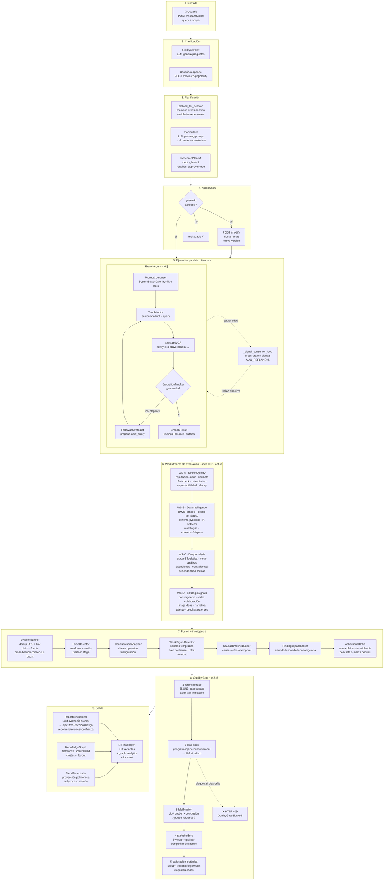
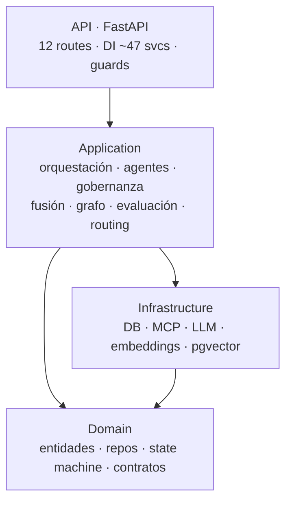
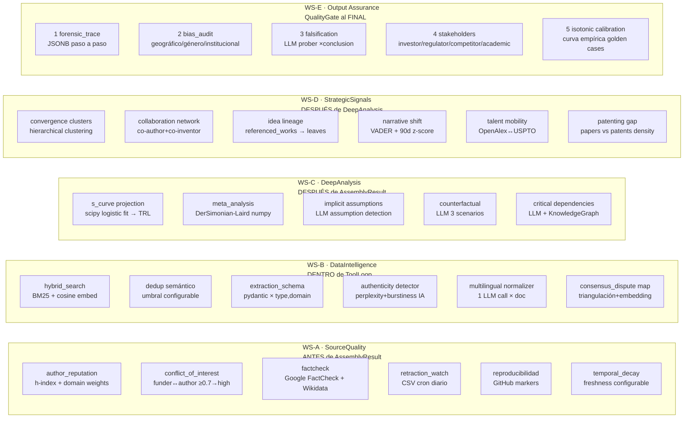
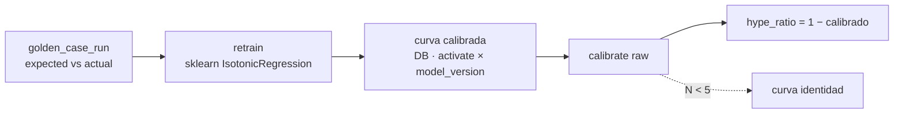
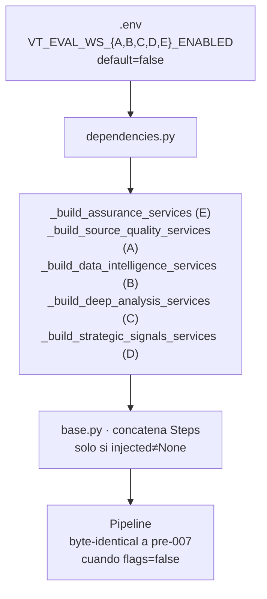
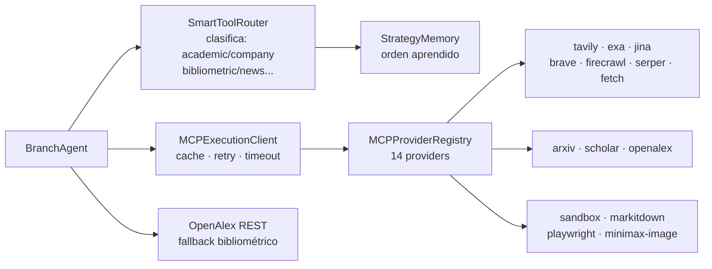
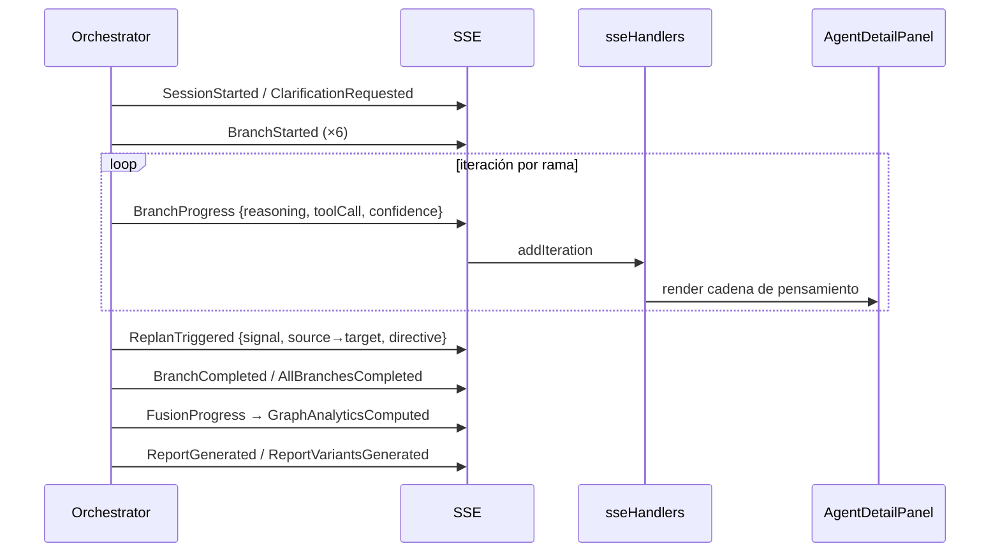
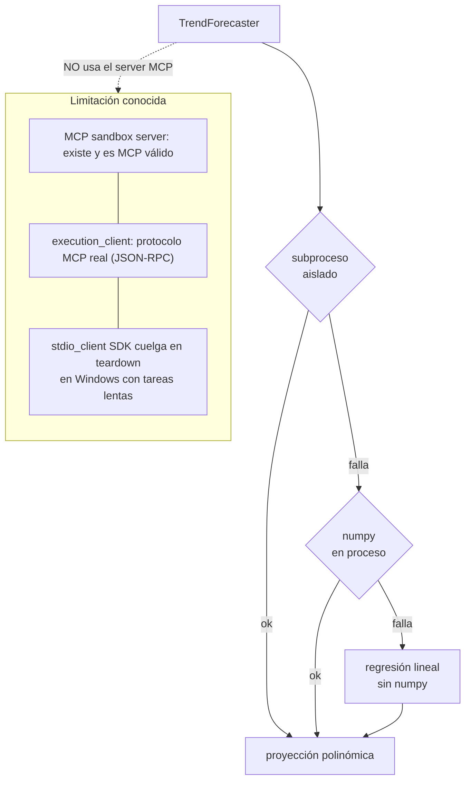

# Arquitectura — Vigilador Tecnológico 2.0

## Flujo completo de una investigación

> **Estados de sesión**: `DRAFT → CLARIFYING → PLANNING → APPROVED → EXECUTING → COMPLETED`
> **Workstreams de evaluación**: WS-A (`VT_EVAL_WS_A_ENABLED`), WS-B, WS-C, WS-D, WS-E — todas `default=false`. Si están apagadas, el pipeline es byte-idéntico a pre-007.

---

## Capas

## 5 Workstreams de evaluación (spec 007) — detalle por etapa

## Calibración isotónica

## Wire-up · opt-in por flag

## Agente → MCP → fuentes

## SSE → Frontend

## Ejecución aislada de código (TrendForecaster)

> **Aislamiento de ejecución:** el TrendForecaster ejecuta numpy en
> `subprocess.run` aislado (cwd/env acotado, en `asyncio.to_thread`), no vía
> el servidor MCP sandbox. El protocolo MCP STDIO de `execution_client` se
> reparó (JSON-RPC real, antes era ad-hoc roto), pero el `stdio_client` del
> SDK MCP tiene un teardown que cuelga en Windows con servidores lentos
> (`list_libraries` ✓, `execute_code` ✗). El subproceso directo logra el
> mismo aislamiento, es portable, y degrada con 3 niveles.
