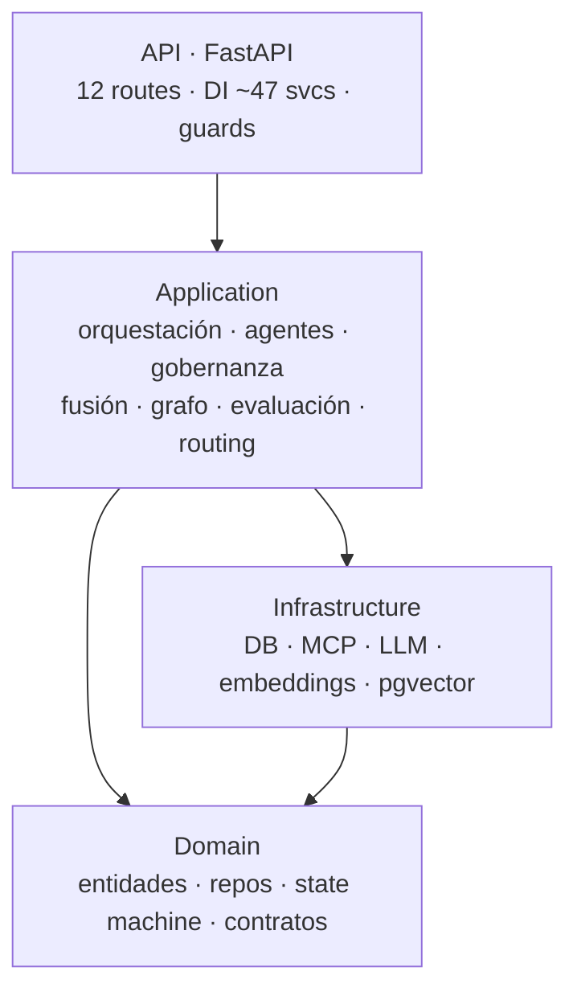
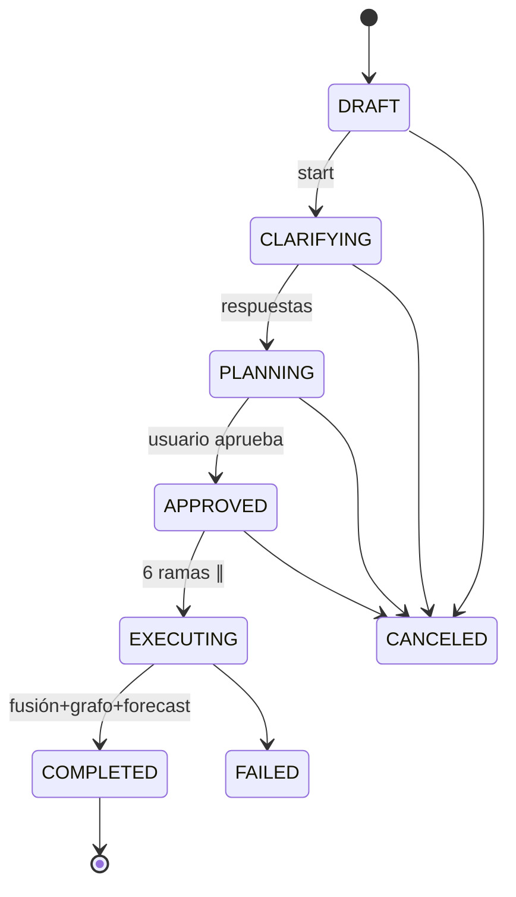
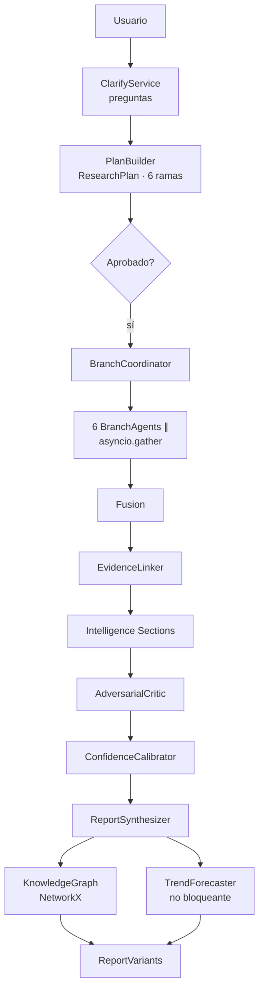
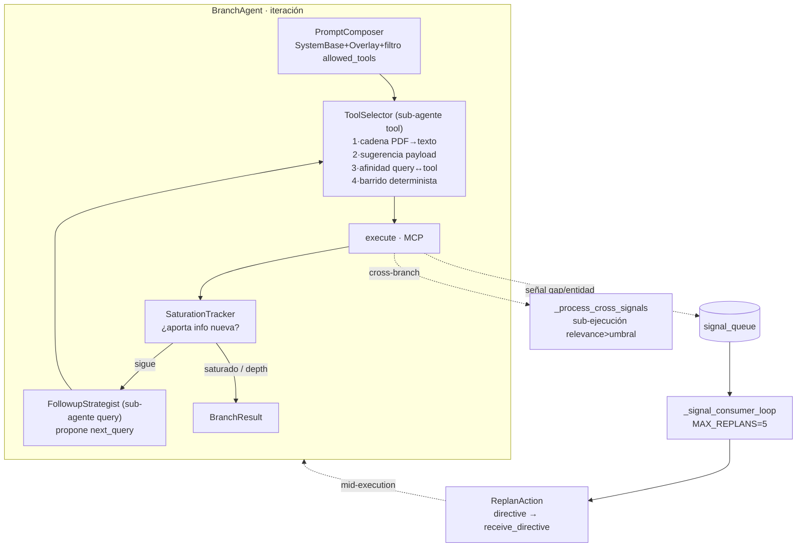
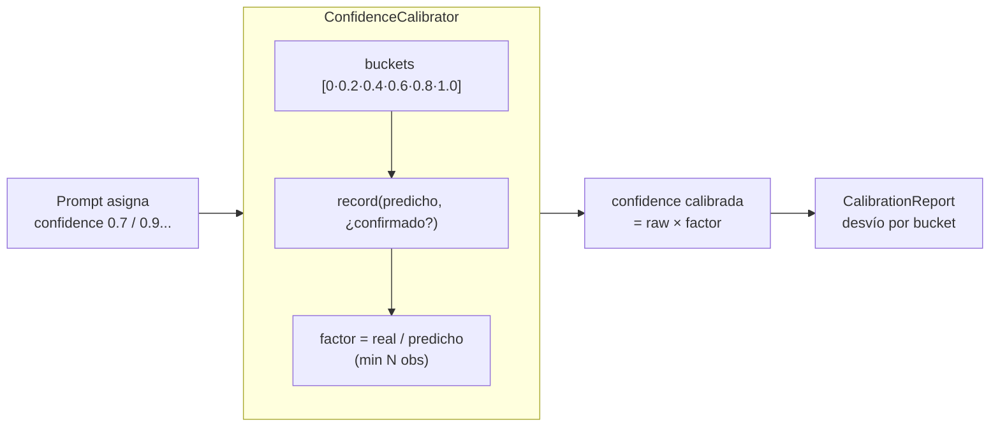
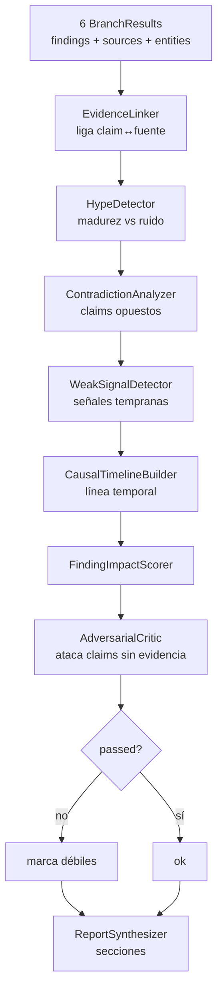
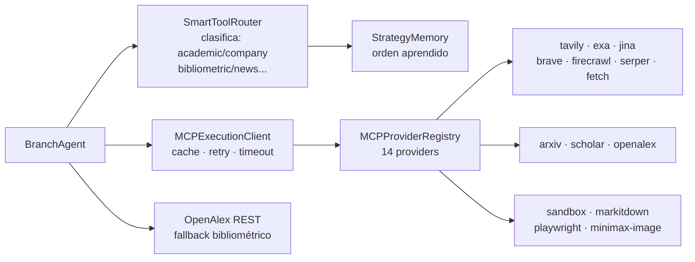
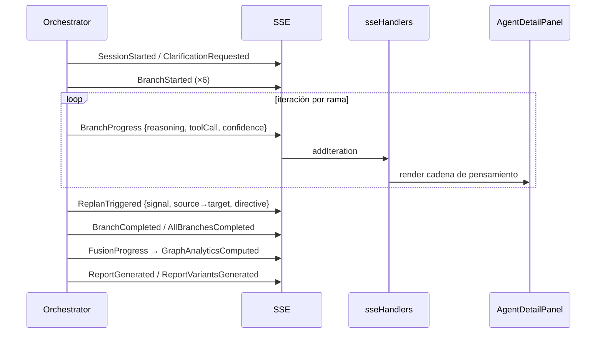
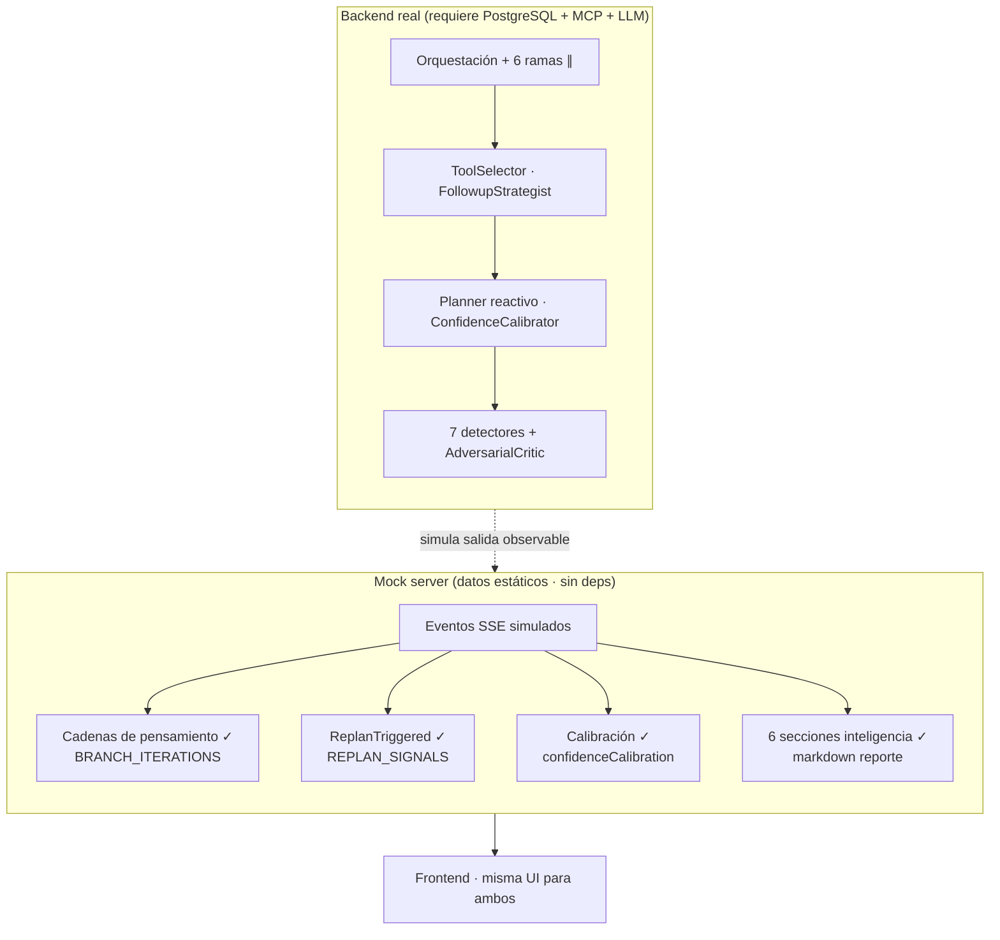
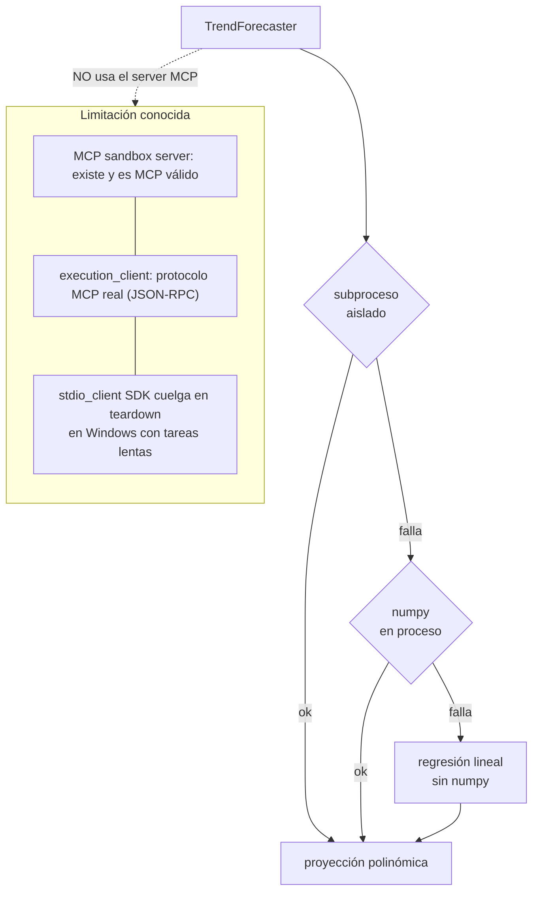

# Arquitectura — Vigilador Tecnológico 2.0

## Capas

## Pipeline de sesión + estados

## Orquestación completa

## Ejecución de rama + sub-agentes + planner reactivo

## Niveles de confianza · calibración

## Pipeline de inteligencia (fusión)

## Agente → MCP → fuentes

## SSE → Frontend

## Mock server vs backend real

## Ejecución aislada de código (TrendForecaster)

> **Aislamiento de ejecución:** el TrendForecaster ejecuta numpy en
> `subprocess.run` aislado (cwd/env acotado, en `asyncio.to_thread`), no vía
> el servidor MCP sandbox. El protocolo MCP STDIO de `execution_client` se
> reparó (JSON-RPC real, antes era ad-hoc roto), pero el `stdio_client` del
> SDK MCP tiene un teardown que cuelga en Windows con servidores lentos
> (`list_libraries` ✓, `execute_code` ✗). El subproceso directo logra el
> mismo aislamiento, es portable, y degrada con 3 niveles.
