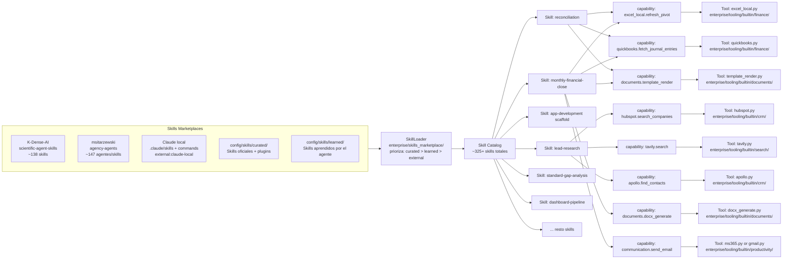
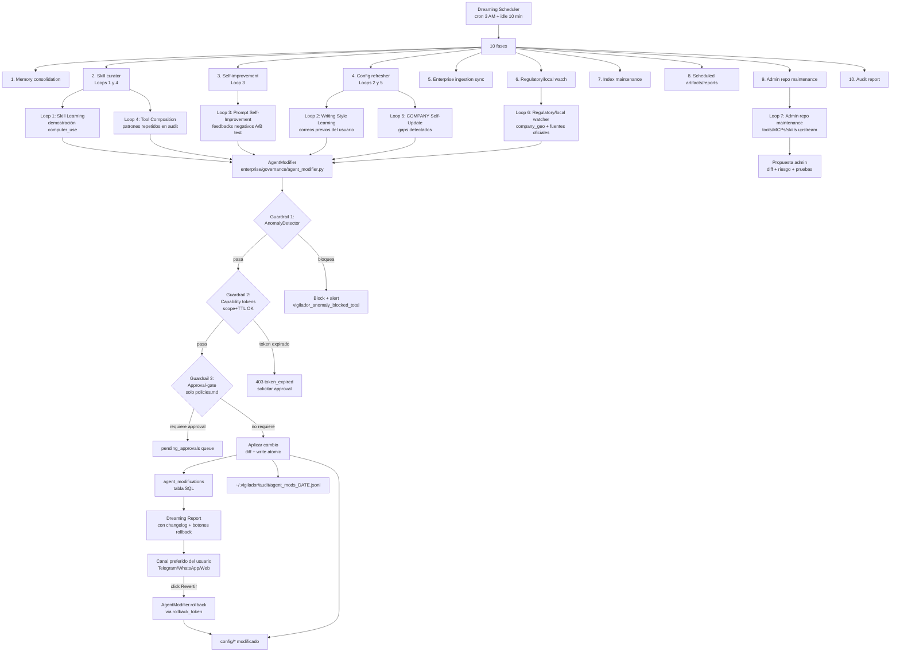
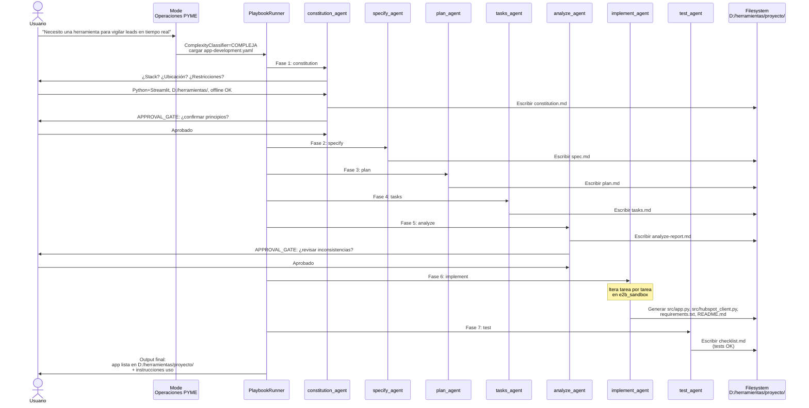

# ANEXO A — Mapa de dependencias

> Diagramas Mermaid que visualizan las relaciones entre componentes, capas, modos y persistencia del Vigilador 3.0. Bonus al set principal — facilita onboarding visual.

> **Corrección vigente**: los diagramas siguen el [00-canon-operativo-corregido.md](00-canon-operativo-corregido.md): frontend completo, TurboVecIndex unico, sin quotas por usuario, providers seleccionables, `company_geo`, Claude local, optimizacion, artefactos y automantenimiento admin.

---

## 1. Componentes core del runtime

Flujo de una petición desde canal hasta persistencia.

```mermaid
flowchart TD
    Canal[Frontend Web consola<br/>+ SSE | Telegram | WhatsApp] --> Gateway[ChannelGateway<br/>api/channels/gateway.py]
    Gateway --> ModeResolver[ModeResolver<br/>enterprise/modes/mode_resolver.py]
    ModeResolver --> ModeContext[ModeContext<br/>SOUL + COMPANY + company_geo<br/>skills/tools filtradas<br/>frozen snapshot]
    ModeContext --> Orch[OrchestratorService<br/>application/orchestration/<br/>PRESERVADO 2.0]
    Orch --> CC[ComplexityClassifier<br/>enterprise/orchestration/<br/>SIMPLE | MODERADA | COMPLEJA]
    CC --> PR[PlaybookRunner<br/>enterprise/orchestration/playbook_runner.py]
    PR -->|technology-watch| BC[BranchCoordinator<br/>PRESERVADO 2.0<br/>6 agentes de rama]
    PR -->|decision-debate| DC[DebateCoordinator<br/>enterprise/orchestration/]
    PR -->|app-development| AppDev[Spec-Kit pipeline<br/>7 agents secuencial]
    PR -->|company-optimization| Opt[Optimization<br/>ISO/NTC/normas tecnicas]
    PR -->|artifact-development| Art[Artifacts<br/>dashboards + pipelines]
    PR -->|goal-pursuit| GP[GoalPursuit<br/>enterprise/orchestration/goal_pursuit/]
    PR -->|general| Gen[Agent generalista]
    PR -->|market-research,compliance,deep-research| Others[Otros playbooks CrewAI]

    BC --> SubReg[SubagentRegistry<br/>recursión depth-aware]
    DC --> SubReg
    AppDev --> SubReg
    Opt --> SubReg
    Art --> SubReg
    GP --> SubReg
    Gen --> SubReg
    Others --> SubReg

    SubReg --> TR[ToolRegistry<br/>discovery semantico<br/>ToolCard -> Summary -> Docs<br/>filtrado por Mode + role]
    TR --> Disp[ParallelToolDispatcher<br/>asyncio.gather de tool_calls]
    Disp --> ToolT1[Tools Tier 1<br/>40 Python + 10 *_local]
    Disp --> ToolT2[Tools Tier 2<br/>23 MCPs externos STDIO<br/>via MCPProcessSupervisor]

    ToolT1 --> Pers[(Metadata DB + TurboVecIndex<br/>JSONL/YAML)]
    ToolT2 --> Pers

    HM[HealthMonitor<br/>cada 30s<br/>mutaciones tool_health] --> Pers
    TR -.solo LEE.-> HM
```

---

## 2. Modos → Playbooks → Skills (composición)

Cómo un Modo filtra el universo de playbooks y skills.

```mermaid
flowchart TD
    Modes[Modos preconfigurados<br/>config/modes/*.yaml] --> CEO[CEO]
    Modes --> CFO[CFO]
    Modes --> Legal[Consultor Legal]
    Modes --> VT[Vigilancia Tech]
    Modes --> Mkt[Marketing]
    Modes --> B2B[Vendedor B2B]
    Modes --> Ops[Operaciones PYME]
    Modes --> Default[default]

    CEO --> CEO_pb[Playbooks: decision-debate,<br/>market-research, goal-pursuit]
    CEO --> CEO_sk[Skills: agency-agents/Strategy,<br/>Marketing, Operations]

    CFO --> CFO_geo[company_geo:<br/>pais/departamento/municipio]
    CFO --> CFO_pb[Playbooks: compliance-audit,<br/>decision-debate, company-optimization]
    CFO --> CFO_sk[Skills: finance:*<br/>reconciliation, variance-analysis,<br/>journal-entry, sox-testing, etc.]

    Legal --> Legal_geo[company_geo:<br/>fuentes oficiales locales]
    Legal --> Legal_pb[Playbooks: compliance-audit,<br/>general, company-optimization]
    Legal --> Legal_sk[Skills: learned/legal-*<br/>+ templates contratos]

    VT --> VT_pb[Playbook: technology-watch<br/>= BranchCoordinator 2.0]
    VT --> VT_sk[Skills del 2.0:<br/>técnicas, riesgo, normativa]

    Mkt --> Mkt_pb[Playbooks: market-research,<br/>goal-pursuit]
    Mkt --> Mkt_sk[Skills: agency-agents/Marketing,<br/>Design, UX Copy]

    B2B --> B2B_pb[Playbooks: deal-research,<br/>general]
    B2B --> B2B_sk[Skills: lead-research,<br/>proposal-generation, email-cadence]

    Ops --> Ops_pb[Playbooks: general,<br/>goal-pursuit, app-development,<br/>artifact-development, company-optimization]
    Ops --> Ops_sk[Skills: process-automation,<br/>document-generation, report-scheduling]

    Default --> Default_pb[Playbook: general]
    Default --> Default_sk[Skills: todas FREE]

    CEO_sk --> Caps[Capabilities expuestas por Tools]
    CFO_sk --> Caps
    Legal_sk --> Caps
    VT_sk --> Caps
    Mkt_sk --> Caps
    B2B_sk --> Caps
    Ops_sk --> Caps
    Default_sk --> Caps

    Caps --> Tools[Tool/MCP catalog SSOT<br/>discovery semantico<br/>enterprise/tooling/builtin/*]
```



---

## 3. Skills / Capabilities / Tools (el catálogo)

Relación entre Skills (recetas), Capabilities (verbos) y Tools (módulos).



---

## 4. Persistencia simplificada

Mapa de qué dato vive en qué motor.

```mermaid
flowchart TB
    subgraph PG["Metadata DB - PostgreSQL existente"]
        PG1[oauth_credentials]
        PG2[subagents]
        PG3[document_chunks<br/>metadata + ACL + source refs]
        PG4[prompt_versions<br/>subsumido en agent_modifications]
        PG5[tool_health]
        PG6[pending_approvals]
        PG7[capability_tokens]
        PG8[kg_nodes / kg_edges<br/>investigación + empresarial]
        PG9[event_subscriptions]
        PG10[scheduled_reports]
        PG11[agent_modifications<br/>audit trail D4]
        PG12[pi_quarantine]
        PG13[audit_events_jsonl_index]
        PG14[artifact_registry<br/>dashboards + pipelines]
        PG15[optimization_evidence<br/>ISO/NTC/normas]
    end

    subgraph TV["TurboVecIndex - indice vectorial unico 3.0"]
        TV1[~/.vigilador/turbovec/<tenant>.tq<br/>reconstruible desde fuentes/metadata]
    end

    subgraph SQ["SQLite FTS5 opcional"]
        SQ1[~/.vigilador/sessions/<tenant>.db<br/>FTS5 virtual table<br/>DISCOVERY / SCROLL / BROWSE]
    end

    subgraph JL["JSONL files - logs operacionales"]
        JL1[~/.vigilador/audit/events_DATE.jsonl]
        JL2[~/.vigilador/audit/agent_mods_DATE.jsonl]
        JL3[~/.vigilador/audit/pi_quarantine_DATE.jsonl]
        JL4[~/.vigilador/dream-log/DATE.md]
        JL5[~/.vigilador/mcp-logs/NAME.jsonl]
        JL6[~/.vigilador/healthcheck.log]
    end

    subgraph YL["YAML files - config declarativa"]
        YL1[config/soul.md]
        YL2[config/company/identity.md<br/>organization.md<br/>processes.md<br/>systems.md<br/>policies.md]
        YL3[config/playbooks/*.yaml]
        YL4[config/modes/*.yaml<br/>NUEVO esta sesión]
        YL5[config/templates/**]
        YL6[config/skills/<br/>curated y learned]
        YL7[config/settings.yaml]
        YL8[config/mcp/external.yaml]
    end

    Embed[Embedding provider seleccionable<br/>Gemini API existente o local opcional] --> PG3
    Embed --> TV1

    Sessions[Transcripts de sesiones] --> SQ1

    Runtime[Runtime ops] --> JL1
    AgentMod[AgentModifier doc 05] --> JL2
    AgentMod -.replica.-> PG12
    PIDetector[PI defense doc 08] --> JL3
    PIDetector -.replica.-> PG13
    Dreaming[Dreaming reporter] --> JL4
    MCPSup[MCPProcessSupervisor] --> JL5
    HM[HealthMonitor] --> JL6

    PG2 --> SubAgents[Subagentes con depth + status]
    PG7 --> CapTokens[Capability tokens ephemeral]

    Backup[Backup automatizado Dreaming Fase 5] -.pg_dump.-> PG
    Backup -.tar.-> TV1
    Backup -.tar.-> SQ1
    Backup -.NO se backupea.-> JL
    Backup -.responsabilidad del usuario en git.-> YL
```



---

## 5. Ciclo de autoaprendizaje y automantenimiento

Cómo los loops del Dreaming interactúan con el AgentModifier, indexacion, normativa local y automantenimiento admin.



---

## 6. Integración 2.0 → 3.0 (preservar / extender / nuevo)

Vista de alto nivel de qué se preserva y qué es nuevo.

```mermaid
flowchart LR
    subgraph V2["VIGILADOR 2.0 - PRESERVADO INTACTO"]
        V2_Orch[OrchestratorService]
        V2_BC[BranchCoordinator + 6 agentes rama]
        V2_PC[PromptComposer + ContractLoader]
        V2_MCP[MCPExecutionClient + 15 providers]
        V2_API[/api/v2/research/*]
        V2_Tests[Tests 002-008 al 100%]
        V2_FE[Frontend React D3]
        V2_Eval[Evaluation framework analytics+audit+forensic]
        V2_WS[Workstreams WS-A..WS-E<br/>pipeline steps]
        V2_Ports[domain/ports/*]
        V2_Infra[infra embeddings/reranking/mcp/persistence/llm]
        V2_Mem[CrossSessionService + Memory]
    end

    subgraph V3New["VIGILADOR 3.0 - SUBPAQUETE PARALELO enterprise/"]
        V3_Modes[modes/ NUEVO esta sesión]
        V3_SkillMkt[skills_marketplace/ NUEVO esta sesión]
        V3_Orch[orchestration/ playbook_runner + complexity + goal_pursuit]
        V3_Intel[intelligence/ self_correction + cove + confidence + fewshot]
        V3_Gov[governance/ agent_modifier NUEVO + PI + anomaly + caps tokens]
        V3_Drm[dreaming/ scheduler + 10 tasks incl 3 NUEVAS]
        V3_Tool[tooling/builtin/ 79 capacidades en 17 dominios]
        V3_MCP[mcp/process_supervisor 15 procesos STDIO]
        V3_Obs[observability/ Prometheus + OTel + dashboard]
        V3_Ing[ingestion/ Drive+OneDrive+WhatsApp+local_fs]
        V3_Opt[optimization/ ISO + NTC + mejora procesos]
        V3_Art[artifacts/ dashboards + pipelines]
        V3_Auth[auth/ OAuth + SSO + capability_tokens]
    end

    subgraph V3Ext["EXTENDIDO - OCP sin tocar base"]
        Ext1[BranchOverlay -> DomainProfile]
        Ext2[VectorIndex -> TurboVecIndex unico]
        Ext3[Model adapters por proveedor]
        Ext4[EmbeddingGateway/Reranker -> providers seleccionables]
        Ext5[MCPProviderRegistry + external.yaml]
    end

    subgraph V3Cfg["CONFIG NUEVO"]
        Cfg1[config/modes/*.yaml]
        Cfg2[config/playbooks/*.yaml incl app-development]
        Cfg3[config/company/*.md 5 archivos]
        Cfg4[config/skills/curated y learned]
        Cfg5[config/templates/]
        Cfg6[config/soul.md]
    end

    V2_BC -->|invocado por| V3_Orch
    V3_Orch -->|usa| V2_PC
    V3_Tool -.coexiste con.-> V2_MCP

    V3New --> Ext1
    V3New --> Ext2
    V3New --> Ext3
    V3New --> Ext4
    V3New --> Ext5

    V3New --> V3Cfg
```

---

## 7. Spec-Kit como playbook `app-development`

Flujo del playbook que cierra la brecha 4.



---

## Notas de mantenimiento

- Cuando se añadan nuevos componentes o flujos al set, actualizar el diagrama relevante en este anexo en el **mismo PR**.
- Los diagramas son `mermaid` para que cualquier visor compatible (GitHub, GitLab, VS Code, Obsidian) los renderice.
- Si un diagrama supera ~50 nodos, splittearlo en sub-diagramas más enfocados.
