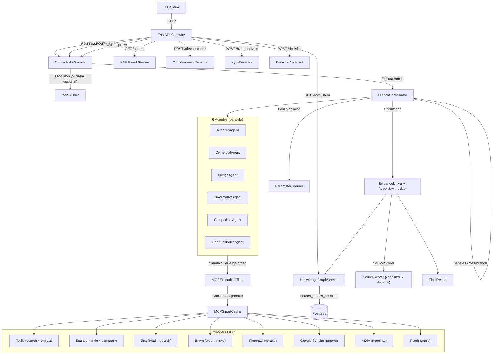
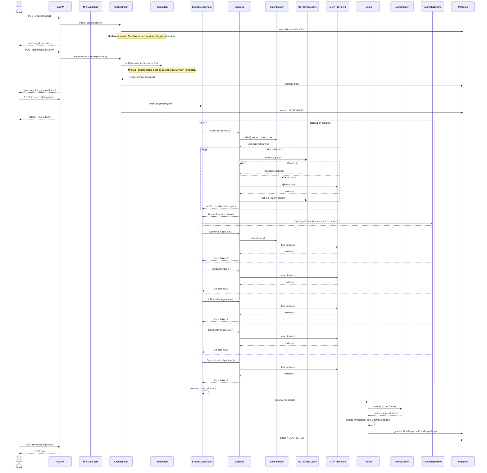
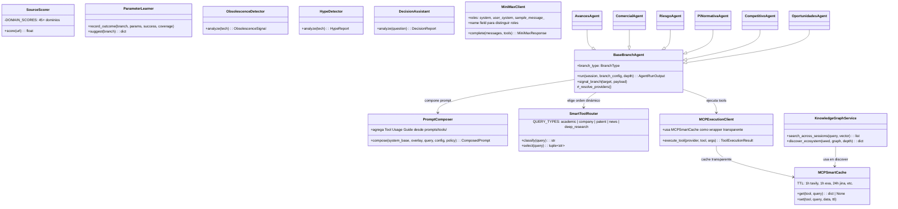
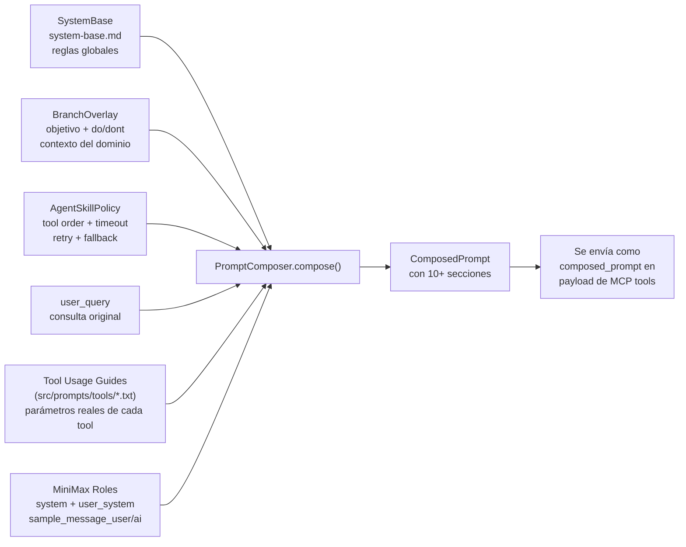
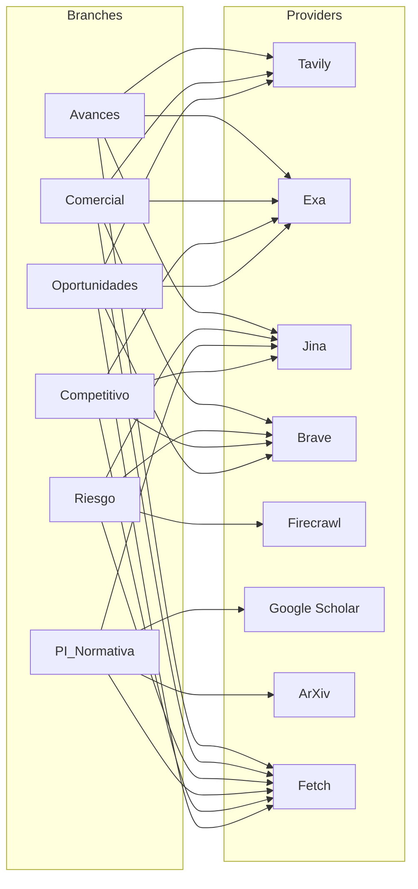

# Backend Flow — Vigilador Tecnológico 2.0

## Arquitectura General



## Flujo de una Investigación (con nuevas features)



## Nuevos Endpoints de Inteligencia

```mermaid
graph LR
    subgraph Endpoints["Nuevos endpoints Phase 9"]
        E1["POST /research/{id}/obsolescence?tech=..."]
        E2["POST /research/{id}/hype-analysis?tech=..."]
        E3["POST /research/{id}/decision?question=..."]
    E4["GET /research/{id}/graph/ecosystem?seed=...&depth=..."]
    E5["GET /research/{id}/graph/search-cross-session?query=..."]

    subgraph Servicios
        S1["ObsolescenceDetector\n+ brave_news + exa"]
        S2["HypeDetector\n+ arxiv + exa + firecrawl"]
        S3["DecisionAssistant\n+ branch_results heuristic"]
        S4["discover_ecosystem()"]
        S5["search_across_sessions()"]
    end

    E1 --> S1
    E2 --> S2
    E3 --> S3
    E4 --> S4
    E5 --> S5
```

## Internal Architecture (con nuevas clases)



## Composición de Prompts (System Base + Tool Usage)



## Mapeo Ramas → MCPs (con Fetch)



## Flujo de Datos por Rama (con SmartRouter + Cache)

```mermaid
flowchart TB
    subgraph Rama["Cada rama ejecuta:"]
        direction TB
        Q["focus_query[0]"] --> Router["SmartToolRouter.select()"]
        Router -->|"academic"| MCP1["search_papers"]
        Router -->|"company"| MCP1["web_search_advanced_exa"]
        Router -->|"general"| MCP1["tool_order por defecto"]

        MCP1 -->|cache hit| Payload["ToolExecutionResult"]
        MCP1 -->|cache miss| Tool1["Ejecutar tool #1"]
        Tool1 -->|"éxito"| Store1["MCPSmartCache.set()"]
        Store1 --> Payload
        Tool1 -->|"falla"| MCP2["Tool #2 (fallback)"]

        MCP2 -->|cache hit| Payload
        MCP2 -->|cache miss| Tool2
        Tool2 -->|"éxito"| Store2
        Store2 --> Payload
        Tool2 -->|"falla"| MCP3["Tool #3 (fallback)"]

        MCP3 -->|cache hit| Payload
        MCP3 -->|cache miss| Tool3
        Tool3 -->|"éxito"| Store3
        Store3 --> Payload
        Tool3 -->|"falla"| FAIL["FAILED branch"]

        Payload --> Iteration["run_followup_loop()"]
        Iteration -->|needs_follow_up| Q2["next_query"]
        Q2 --> Router
        Iteration -->|depth_limit| Done["Iteraciones completadas"]
    end

    Done --> Signal["signal_branch() cross-branch"]
    Signal --> PL["ParameterLearner.record_outcome()"]
    PL -->["_process_cross_signals()\nre-ejecuta agent.run()\ncon depth_limit=2"]
    PL --> Embed["Gemini Embedding 2\nembedding vectors por iteración"]
    Embed --> Relations["build_relations()\nsemantic dedup + support"]
    Relations --> Result["BranchResult\nfindings + sources + errores\n+ SourceRef.confidence aplicado"]
```

## Archivos Clave

| Capa | Archivos |
|------|---------|
| **API** | `api/app.py`, `api/router.py`, `api/routes/research_*.py`, `api/routes/system_base.py` |
| **Agentes** | `application/agents/base.py`, `application/agents/*_agent.py` |
| **Gobernanza** | `application/governance/contract_loader.py`, `application/governance/prompt_composer.py`, `application/governance/system_base_loader.py`, `application/governance/validators.py`, `application/governance/smart_router.py` |
| **MCP** | `infra/mcp/provider_registry.py`, `infra/mcp/execution_client.py`, `infra/mcp/mcp_cache.py` |
| **MiniMax** | `infra/llm/minimax_client.py`, `domain/system_base.py` (MiniMaxMessage) |
| **Orquestación** | `application/orchestration/orchestrator_service.py`, `application/execution/branch_coordinator.py` |
| **Gráfo** | `application/graph/knowledge_graph_service.py`, `infra/persistence/vector_index.py` |
| **Fusión** | `application/fusion/evidence_linker.py`, `application/fusion/report_synthesizer.py`, `application/fusion/decision_assistant.py` |
| **Evaluación** | `application/evaluation/source_scorer.py`, `application/evaluation/parameter_learner.py`, `application/evaluation/obsolescence_detector.py`, `application/evaluation/hype_detector.py` |
| **Prompts** | `prompts/orchestration/*.txt`, `prompts/branches/*.txt`, `prompts/tools/*.txt`, `prompts/minimax_examples/*.txt` |
| **Serper** | `infra/serper/serper_client.py` (REST API, no MCP) |
| **Config** | `config/settings.py` |
| **Tests** | `tests/test_*.py` **(59 tests)** |
